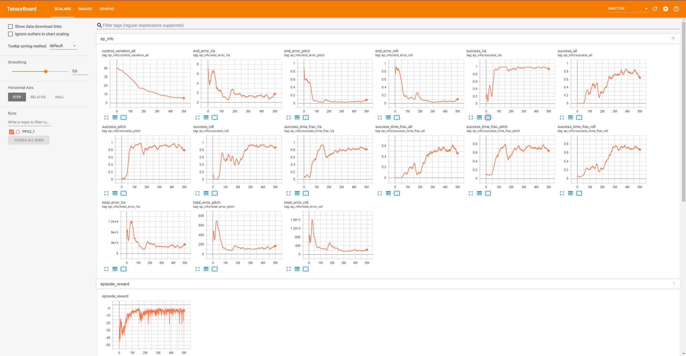

### Installation
In addition to the dependencies of the gym environment itself, running these example scripts require Python 3.5-7, stable-baselines and tensorflow 1.
These additional requirements can be installed by running the commands below. To use the CNN-MLP policy described in the paper requires my [fork](https://github.com/eivindeb/stable-baselines) of the stable-baselines repository, which is specified
in the requirements_cnn.txt file. Please note that the included MLP controller from the models folder is incompatible with this fork.
For any installation errors from stable-baselines, please refer to the [documentation](https://stable-baselines.readthedocs.io/en/master/guide/install.html).

```shell
pip install -r requirements.txt
```

OR

```shell
pip install -r requirements_cnn.txt
```

### Evaluating controllers
The test_sets folder contains the four test sets used in the paper. Controllers can be evaluated on these sets by doing e.g.:
```shell
python evaluate_controller.py test_sets/test_set_wind_none_step20-20-3.npy --num-envs 4 --PID --env-config-path fixed_wing_config.json --turbulence-intensity "none"
```

```shell
python evaluate_controller.py test_sets/test_set_wind_moderate_step20-20-3.npy --num-envs 4 --model-path models/mlp_controller/model.pkl --turbulence-intensity "moderate"
```

Which will evaluate the PID controller on the test set with no wind or turbulence and the MLP controller on the moderate turbulence set,
 respectively. The model folder contains the CNN RL controller used in the paper, as well as an MLP RL controller usable with the default version of stable-baselines.

The included RL controllers and the PID controller were evaluated on these sets with PyFly v0.1.2 (commit #21f5b5c812330e1d5356d4b6b5fc774753839892), 
producing the results shown in the table below. To reproduce the results shown here, make sure to use this PyFly version.

|                     	|            	|       	| Success 	|     	|     	|       	| Rise time 	|       	|       	| Settling time 	|       	|       	| Overshoot 	|     	| Control variation 	|
|---------------------	|:----------:	|:-----:	|:-------:	|:---:	|:---:	|:-----:	|:---------:	|:-----:	|:-----:	|:-------------:	|:-----:	|:-----:	|:---------:	|:---:	|:-----------------:	|
| Setting             	| Controller 	| &phi; 	| &theta; 	|  Va 	| All 	| &phi; 	|  &theta;  	|   Va  	| &phi; 	|    &theta;    	|   Va  	| &phi; 	|  &theta;  	|  Va 	|                   	|
| No turbulence       	| RL (CNN)   	|   100 	|     100 	| 100 	| 100 	| 0.253 	|     0.614 	| 0.803 	| 1.594 	|         1.580 	| 2.704 	|    25 	|        34 	|  31 	|             0.638 	|
|                     	| RL (MLP)   	|   100 	|     100 	| 100 	| 100 	| 1.395 	|     0.336 	| 0.959 	| 2.085 	|         1.675 	| 2.308 	|     5 	|        25 	|  20 	|             0.410 	|
|                     	| PID        	|   100 	|     100 	| 100 	| 100 	| 1.337 	|     0.226 	| 1.016 	| 2.018 	|         1.294 	| 2.203 	|     3 	|         9 	|  29 	|             0.291 	|
| Light turbulence    	| RL (CNN)   	|   100 	|     100 	| 100 	| 100 	| 0.201 	|     0.657 	| 0.654 	| 1.652 	|         1.699 	| 2.521 	|    32 	|        50 	|  52 	|             0.779 	|
|                     	| RL (MLP)   	|   100 	|     100 	| 100 	| 100 	| 1.238 	|     0.423 	| 0.884 	| 2.062 	|         1.845 	| 2.419 	|     6 	|        28 	|  37 	|             0.851 	|
|                     	| PID        	|   100 	|     100 	| 100 	| 100 	| 1.132 	|     0.291 	| 0.967 	| 2.008 	|         1.364 	| 2.225 	|     7 	|        11 	|  38 	|             0.476 	|
| Moderate turbulence 	| RL (CNN)   	|   100 	|     100 	| 100 	| 100 	| 0.185 	|     0.861 	| 0.557 	| 2.000 	|         2.117 	| 3.748 	|    53 	|        87 	| 105 	|             0.823 	|
|                     	| RL (MLP)   	|    98 	|      97 	|  97 	|  97 	| 0.890 	|     0.680 	| 0.643 	| 2.799 	|         2.927 	| 3.660 	|    89 	|        68 	|  91 	|             1.279 	|
|                     	| PID        	|   100 	|      98 	|  97 	|  93 	| 0.835 	|     0.406 	| 0.739 	| 2.131 	|         1.674 	| 2.920 	|    22 	|        22 	|  82 	|             0.702 	|
| Severe turbulence   	| RL (CNN)   	|    98 	|      98 	|  97 	|  97 	| 0.148 	|     1.492 	| 0.349 	| 2.232 	|         2.458 	| 6.146 	|    90 	|       152 	| 226 	|             0.885 	|
|                     	| RL (MLP)   	|    93 	|      92 	|  91 	|  91 	| 0.740 	|     1.002 	| 0.538 	| 3.477 	|         4.028 	| 4.975 	|   108 	|        92 	| 215 	|             1.698 	|
|                     	| PID        	|    98 	|      98 	|  94 	|  83 	| 0.683 	|     0.557 	| 0.642 	| 2.463 	|         2.560 	| 4.280 	|    64 	|        51 	| 126 	|             0.826 	|

The outputs of the evaluation scripts can be found in the evaluations folder. They are in numpy format and contain the result dictionary, to
process them in python do:
```python
res = np.load("eval_res.npy", allow_pickle=True).item()
```
Evaluation results can also be outputted by supplying the evaluation results file path in place of the test set path along with the --print-results flag:
```shell
python evaluate_controller.py evaluations/eval_res_RL_CNN_severe.npy --print-results
```
Due to refactoring of the code base, non-determinism that has since been eliminated and various other changes in the gym environment,
 these are not the exact values reported in the paper, however, they support the same trends highlighted in the paper.

Note that the RL MLP controller does not represent any best efforts to produce an optimal controller, but rather the controller
obtained by running the example training script below once.

### Training controllers

To train a reinforcement learning controller, run the train_rl_controller.py script, e.g. to train an agent using 4 processes for 5 million time steps and evaluate on the no turbulence test set, do:
```shell
python train_rl_controller.py "ppo_example" 4 --test-set-path test_sets/test_set_wind_none_step20-20-3.npy
```

This script trains a PPO agent to do attitude control of a fixed-wing aircraft. It saves checkpoints of models, renders episodes
 during training so that its behavior can be inspected, runs periodic test set evaluations if a test set path is supplied, and logs
 all training information to tensorboard such that its progress can be monitored.
 
 ```shell
tensorboard --logdir models/ppo_example/tb
```



## Citation
If you use this software in your work, please consider citing:

```text
@inproceedings{bohn2019deep,
  title={Deep Reinforcement Learning Attitude Control of Fixed-Wing UAVs Using Proximal Policy optimization},
  author={B{\o}hn, Eivind and Coates, Erlend M and Moe, Signe and Johansen, Tor Arne},
  booktitle={2019 International Conference on Unmanned Aircraft Systems (ICUAS)},
  pages={523--533},
  year={2019},
  organization={IEEE}
}
```
